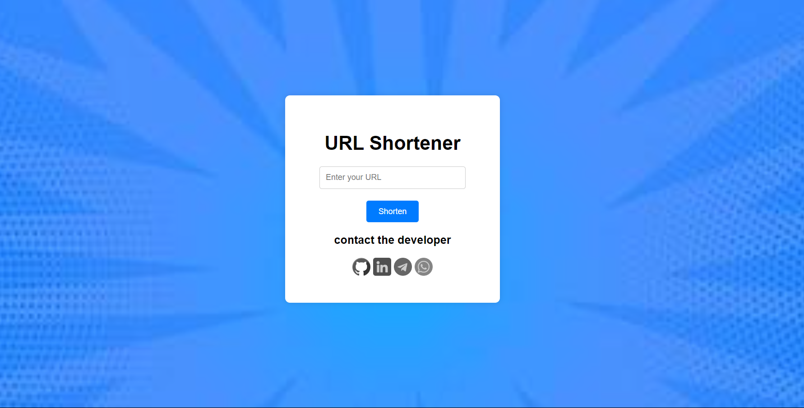

---

# URL Shortener Service

A URL shortener service that allows users to shorten long URLs and redirects users to the original URL when accessed. This project uses Express.js (Node.js) to handle URL redirection and MongoDB to store mappings.

 <!-- Add a screenshot of your website here -->


## Features

- Shorten long URLs.
- Redirect to the original URL using the shortened link.
- Simple frontend for inputting URLs and getting shortened links.
- Copy button to easily copy the shortened link.

## Tech Stack

- **Backend:** Node.js, Express.js
- **Database:** MongoDB
- **Frontend:** HTML, CSS, JavaScript

## Project Structure

```plaintext
url-shortener/
├── .env
├── .gitignore
├── package.json
├── README.md
├── server.js
├── models/
│   └── Url.js
├── routes/
│   └── url.js
├── controllers/
│   └── urlController.js
├── config/
│   └── db.js
└── public/
    ├── index.html
    ├── css/
    │   └── styles.css
    └── js/
        └── scripts.js
```

## Installation

### Clone the repository

```bash
git clone https://github.com/fitsumhelina/url-shortener.git
cd url-shortener
```

### Install dependencies

```bash
npm install
```

### Create a `.env` file and add the following variables:

```env
PORT=5000
MONGO_URI=your_mongodb_connection_string
BASE_URL=http://localhost:5000
```

### Run the server

```bash
npm run dev
```

### Access the application

Open your browser and go to [http://localhost:5000](http://localhost:5000).

## Usage

- **Shorten a URL:** Enter a long URL in the input field and click the "Shorten" button.
- **Copy the Shortened URL:** Click the "Copy" button to copy the shortened URL to the clipboard.
- **Redirect to the Original URL:** Click the shortened URL to be redirected to the original long URL.

## API Endpoints

### Shorten URL

- **URL:** `/shorten`
- **Method:** `POST`
- **Body:** `{"longUrl": "http://example.com"}`
- **Response:**
    ```json
    {
      "longUrl": "http://example.com",
      "shortUrl": "http://localhost:5000/abc123",
      "urlCode": "abc123",
      "date": "2023-07-20T14:00:00.000Z"
    }
    ```

### Redirect to Original URL

- **URL:** `/:code`
- **Method:** `GET`
- **Response:** Redirects to the original long URL.

## License

This project is licensed under the MIT License. See the [LICENSE](LICENSE) file for details.

## Contributing

Contributions are welcome! Please open an issue or submit a pull request for any improvements or bug fixes.

## Contact

<p >
  
</p>

- **Name:** Fitsum Helina
- **Email:** dev.fitsum@example.com
- **Portfolio:** [https://fitsumhelina.vercel.app](https://fitsumhelina.vercel.app)

---
